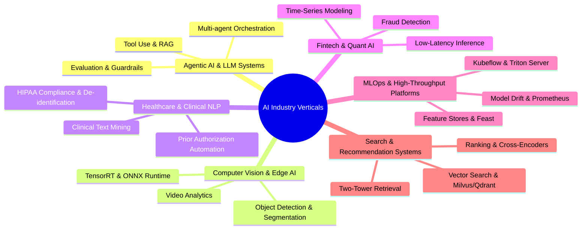

# Domain Intelligence & Production Capstone Project Blueprints

> **Purpose**: This document outlines the market intelligence, junior/intern expectation matrices, and production-grade Capstone Project blueprints across the 6 core AI industry verticals.

---

## 1. The 6 Core AI Industry Verticals

---

## 2. Industry Expectation Matrices for Intern / Junior Roles

| Vertical | Core Technologies | Junior/Intern Baseline Expectations | Red Flags to Avoid |
|---|---|---|---|
| **Agentic AI & LLMs** | Python, LangChain, LangGraph, LlamaIndex, vLLM, FastEmbed | Understands ReAct prompting, structured JSON schema outputs, vector index chunking, and deterministic tool execution. | Toy chatbots without evaluations, hardcoded prompt strings without schema enforcement. |
| **Computer Vision** | PyTorch, OpenCV, TensorRT, ONNX Runtime, Ultralytics YOLOv8/v11 | Understands inference batching, CUDA memory management, precision quantization (FP16/INT8), and dataset curation. | Models running unoptimized in Jupyter notebooks without C++ / ONNX deployment. |
| **Healthcare AI** | PyTorch, HuggingFace, BioBERT, SciSpacy, DuckDB, FastAPI | Familiarity with medical entity recognition, clinical note summarization, data anonymization (HIPAA), and validation calibration. | Ignoring data privacy, lack of confidence scoring on medical predictions. |
| **Fintech & Quant** | Python, C++, XGBoost, LightGBM, Polars, Redis, Kafka | Feature engineering on streaming data, class imbalance mitigation (SMOTE, Focal Loss), microsecond latency awareness. | Lookahead bias in financial backtesting, naive accuracy metrics on imbalanced datasets. |
| **MLOps & Infra** | Docker, Kubernetes, Triton, MLflow, Prometheus, Grafana, Feast | Containerization, CI/CD automated model testing, Prometheus metric scraping (latency, throughput, drift), canary deployments. | Manual model deployment via scikit-learn pickle in Flask without metrics or health checks. |
| **Search & RecSys** | Two-Tower Models, Qdrant/Milvus, Cross-Encoders, Redis, PyTorch | Approximate Nearest Neighbor (ANN) indexing (HNSW, IVF-PQ), hybrid keyword-vector search, NDCG/MRR evaluation. | Brute-force cosine similarity over full dataset in memory. |

---

## 3. The 6 Production Capstone Project Blueprints

### Blueprint 1: Enterprise Multi-Agent Knowledge & Code Orchestrator (Agentic AI)
- **Architecture**: Hierarchical Agent Graph (Supervisor Agent -> Research Agent + Tool Agent + Validator Agent) built with LangGraph and FastAPI.
- **Quantifiable SLA**:
  - P95 latency < 1.8s for multi-hop queries.
  - 100% structured JSON response validation with Pydantic.
  - Zero hallucination guardrails evaluated via RAGAS (Faithfulness > 0.92, Context Recall > 0.88).

### Blueprint 2: Real-Time Multi-Camera Edge Vision & Telemetry Pipeline (Computer Vision)
- **Architecture**: RTSP streaming decoder -> TensorRT INT8 Quantized YOLOv11 detector -> DeepSORT tracker -> WebRTC streamer.
- **Quantifiable SLA**:
  - Sustained 60 FPS across 4 concurrent 1080p video streams on a single NVIDIA RTX 4060 / T4 GPU.
  - End-to-end processing latency < 18ms per frame.

### Blueprint 3: Clinical Information Extraction & FHIR-Compliant Summarizer (Healthcare AI)
- **Architecture**: BioClinicalBERT + RoBERTa entity extractor -> NER Span Alignment -> Synthea FHIR JSON format generator.
- **Quantifiable SLA**:
  - Medical Named Entity Extraction F1-Score > 0.91 on NCBI-Disease and i2b2 datasets.
  - Automatic de-identification of 18 HIPAA Safe Harbor identifiers with 99.8% precision.

### Blueprint 4: Ultra-Low-Latency Fraud Detection & Streaming Feature Store (Fintech AI)
- **Architecture**: Apache Kafka event stream -> Feast online store on Redis -> ONNX Runtime C++ / Rust inference service.
- **Quantifiable SLA**:
  - P99 inference latency < 2.5ms at 15,000 requests per second.
  - AUROC > 0.96 with False Positive Rate < 0.05% on high-volume financial transaction stream.

### Blueprint 5: Autonomous End-to-End MLOps Platform with Triton & Drift Remediation (MLOps)
- **Architecture**: Automated model registry with MLflow -> Triton Inference Server on Kubernetes -> Evidently AI drift detector -> Prometheus & Grafana alerting -> Automated retraining trigger.
- **Quantifiable SLA**:
  - Automated canary rollout with zero downtime (< 0.001% 5xx errors during transition).
  - Kolmogorov-Smirnov drift detection computed over 100,000 sliding window requests with automated trigger within 60 seconds of statistical divergence.

### Blueprint 6: Hybrid Search & Personalized Two-Tower Recommendation Engine (Search & RecSys)
- **Architecture**: Bi-Encoder User/Item embeddings -> Qdrant HNSW vector index + BM25 sparse keyword index -> Reciprocal Rank Fusion (RRF) -> Cross-Encoder reranker.
- **Quantifiable SLA**:
  - Mean Reciprocal Rank (MRR@10) > 0.84 and NDCG@10 > 0.79.
  - P95 query latency < 35ms on a 5,000,000-item catalog.
